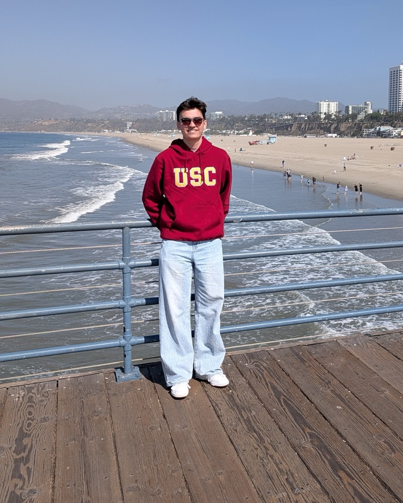

# Viktor Lorentz — personal site

A single-page résumé / portfolio site. Plain HTML, CSS and a little JavaScript. No build step, no framework, nothing to install.

```
index.html   all the content — edit this
styles.css   design tokens, layout, dark mode, motion
script.js    theme toggle, scroll reveal, active nav link, copy-email
assets/      your photos, résumé PDF and social preview image
```

## Preview locally

```bash
cd ~/Portfolio && python3 -m http.server 8080
```

Then open http://localhost:8080. (Opening `index.html` directly also works.)

## Customise

Everything lives in `index.html`. Search for `EDIT ▸` — each block that needs your details is marked.

1. **Hero** — availability line, the two-sentence intro, social links.
2. **About** — two paragraphs, the three facts, optional photo strip.
3. **Experience** — one `<li class="xp-item">` per role, newest first. Placeholder text is in `[brackets]`.
4. **Projects** — one card each. Room Check, World Cup Obby and Terra are filled in; add the real Roblox links.
5. **Skills** — three short lists.
6. **Contact** — your email appears three times in that block; the full list of links lives here too.
7. `<head>` — title, description, and the JSON-LD `sameAs` list of your profiles.

### Adding photos

Drop files into `assets/`, then replace the placeholder `<div class="ph …">` with an ``. Each placeholder has a comment right above it showing the exact tag.

| Placeholder | File | Size |
|---|---|---|
| Hero portrait | `assets/portrait.jpg` | 4:5, e.g. 800×1000 |
| About strip (3) | `assets/photo-1.jpg` … | 1:1, e.g. 800×800 |
| Project covers | `assets/project-room-check.jpg` etc. | 16:10, e.g. 1600×1000 |
| Résumé | `assets/resume.pdf` | — |
| Social preview | `assets/og.jpg` | 1200×630 |

Example, the portrait:

```html

```

### Colours and type

Design tokens are at the top of `styles.css`. Change `--fg` / `--bg` for the palette, or swap the Google Fonts link in `index.html` to change the typefaces (Inter for text, Instrument Serif for the italic accents).

## Deploy

**GitLab Pages** — a `.gitlab-ci.yml` is included. Push to a GitLab repo and the site publishes at `https://<user>.gitlab.io/<repo>/`.

**GitHub Pages** — push to a repo, then Settings → Pages → deploy from the `main` branch root.

**Netlify / Vercel** — drag the folder onto their dashboard, or connect the repo. No build command, publish directory is `/`.

Once live, set `og:image` in `index.html` to the absolute URL of `assets/og.jpg` and update `"url"` in the JSON-LD block.
